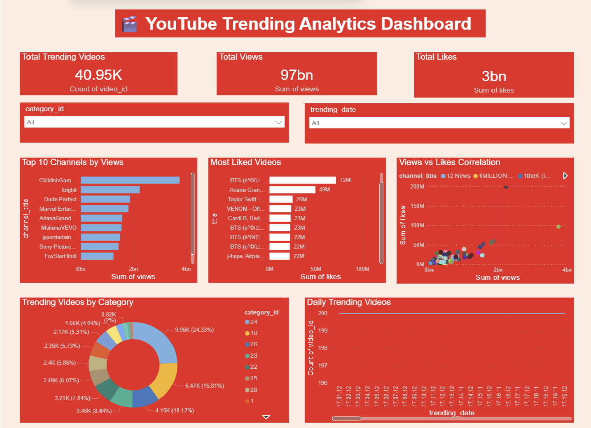

# 🎬 YouTube Trending Analytics Dashboard

### Data Analyst Portfolio Project | 40,949 Videos Analyzed | MySQL + Power BI

## 📊 Dashboard Preview

## 🔥 Key Business Insights
- 📺 Total trending videos analyzed: **40,949**
- 👁️ Total views across all videos: **97 Billion**
- 👍 Total likes across all videos: **3 Billion**
- 🏆 Top channel by views: **Childish Gambino (4bn+ views)**
- 🎵 Most liked video: **Childish Gambino (97M likes)**
- 📂 Largest trending category: **Entertainment (24.33%)**

## 🛠️ Tools Used
- **MySQL** — Database design, data storage, SQL queries
- **Python** — Data cleaning, encoding fix, CSV import via Pandas
- **Power BI** — Interactive dashboard connected live to MySQL
- **Kaggle** — Dataset source

## 📁 Dataset
- Source: Kaggle YouTube Trending Dataset (USvideos.csv)
- Records: 40,949 US trending videos
- Columns: video_id, title, channel_title, category_id, views, likes, dislikes, comment_count

## 🔍 SQL Queries Used
- Top 10 channels by total views
- Most liked videos ranking
- Category performance analysis
- Engagement rate calculation (likes/views ratio)
- Daily trending video count
- Average views per category

## ✨ Dashboard Features
- 3 KPI cards (Total Videos, Total Views, Total Likes)
- Top 10 Channels by Views (Bar Chart)
- Most Liked Videos (Bar Chart)
- Views vs Likes Correlation (Scatter Plot)
- Trending Videos by Category (Donut Chart)
- Daily Trending Videos (Line Chart)
- Interactive slicers (Category ID, Trending Date)
- YouTube red theme 🔴

## 🚀 How to Run
1. Install MySQL and create database: `youtube_analytics`
2. Run `import_youtube.py` to load data into MySQL
3. Open `YouTube Trending Analytics Dashboard.pbix` in Power BI Desktop
4. Connect to your local MySQL instance
5. Refresh data and explore!

## 👩‍💻 About
**Sameera Khedekar** 
📧 sameerakhedekar2006@gmail.com
🔗 [LinkedIn](https://www.linkedin.com/in/sameerakhedekar/)
🐙 [GitHub](https://github.com/sameerakhedekar2006-spec)
